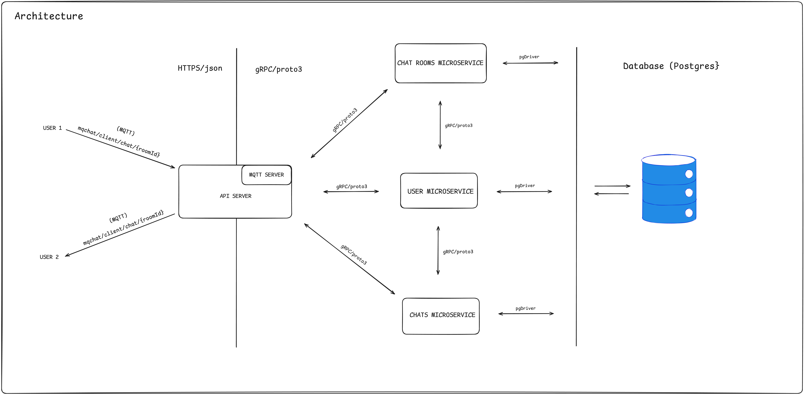
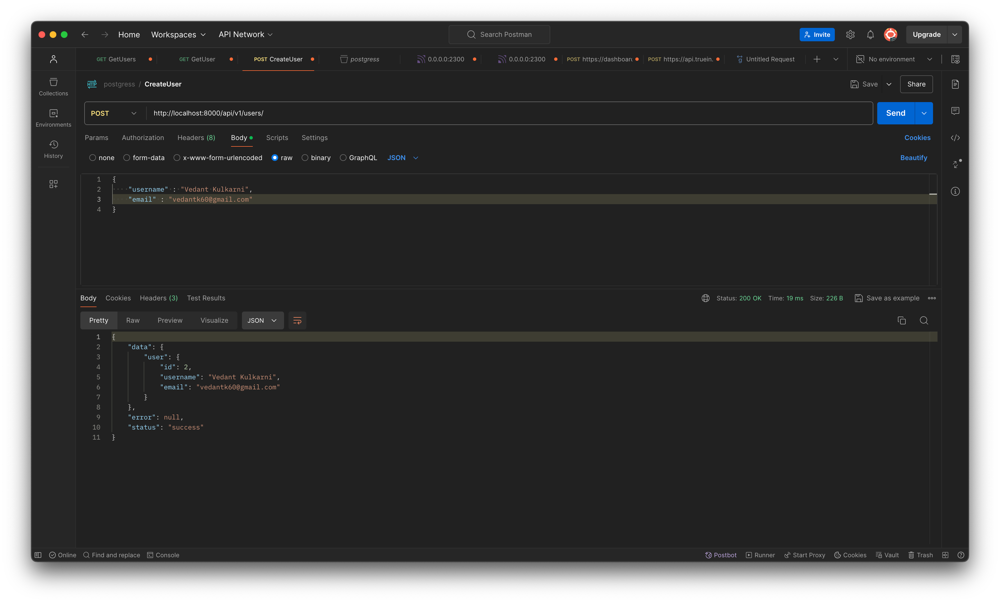
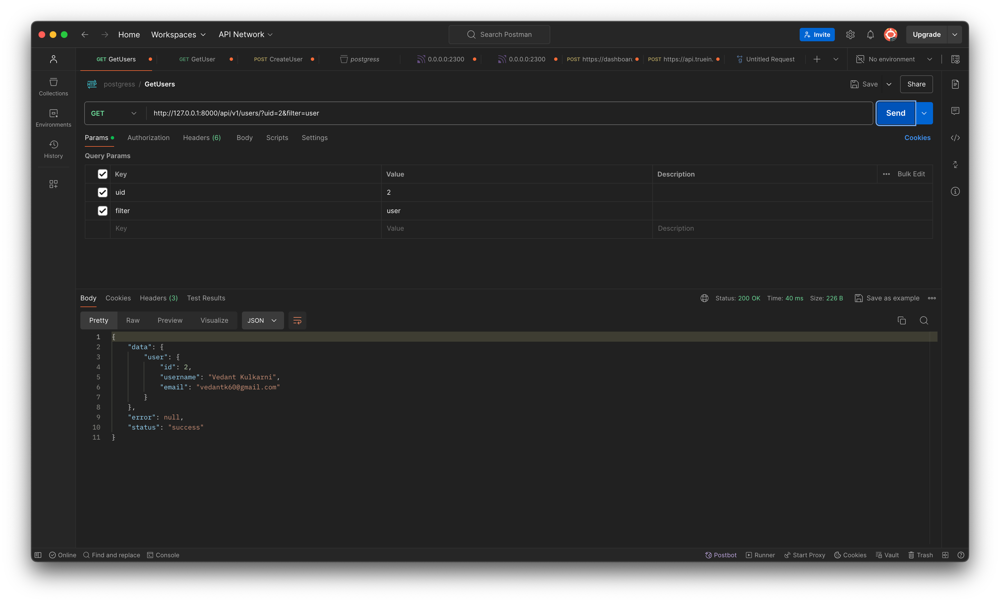
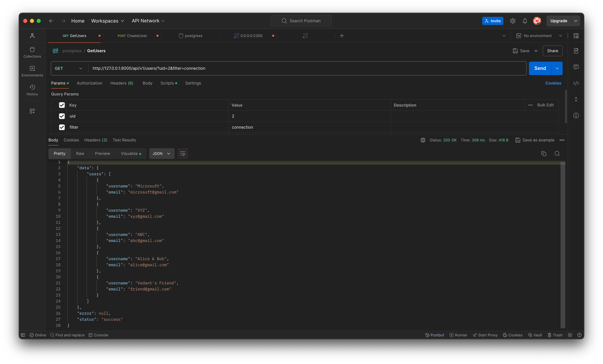
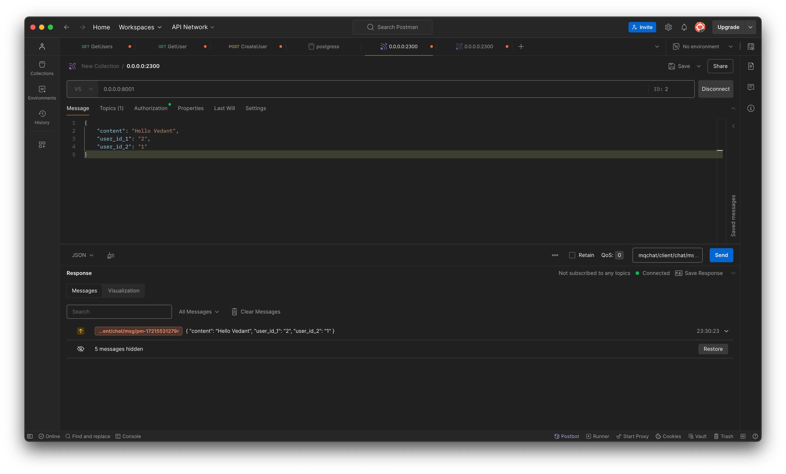
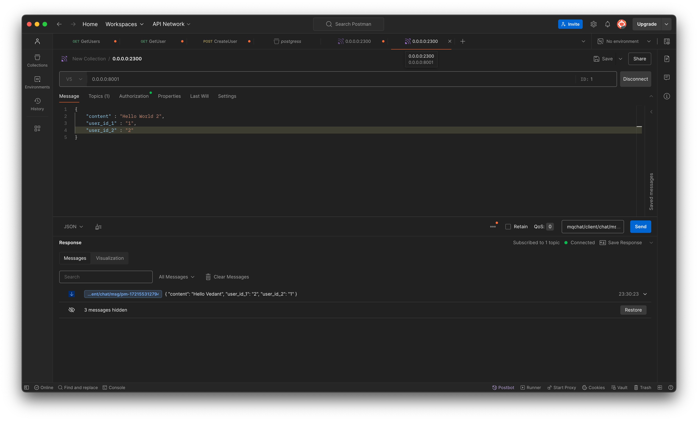
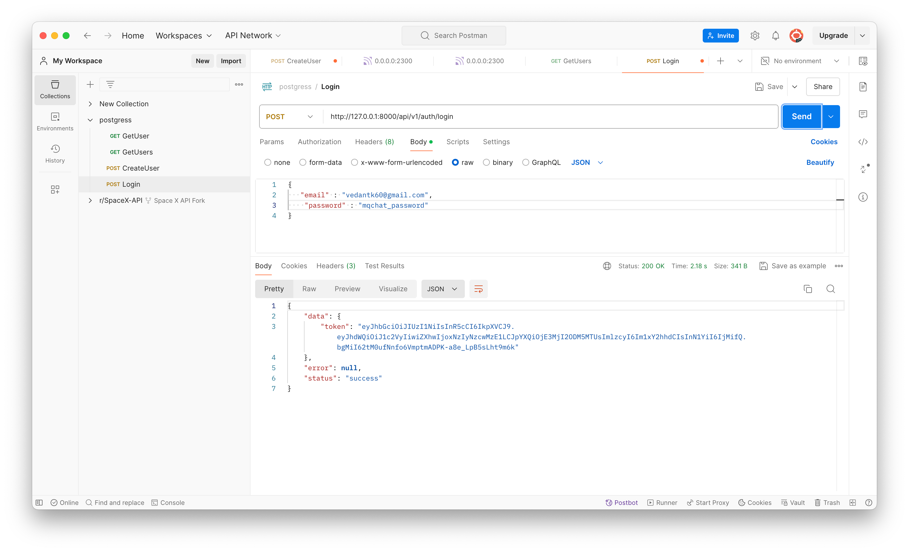
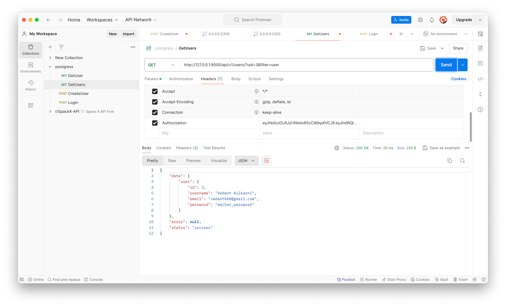

# Chat System Backend

This project is a chat system backend implemented in Go, utilizing a microservices architecture with MQTT, REST API, and gRPC for communication. The system supports real-time messaging and is designed for scalability and modularity.


# Architecture



## Setup Instructions

### Prerequisites

- **Go**: Make sure you have Go installed. You can download it from [golang.org](https://golang.org/dl/).
- **Protocol Buffers Compiler (`protoc`)**: Required for generating Go code from `.proto` files. Installation instructions are available [here](https://grpc.io/docs/protoc-installation/).
- **Docker and Docker Compose**: Ensure you have Docker and Docker Compose installed. You can download them from [docker.com](https://www.docker.com/products/docker-desktop).
- **golang-migrate**: A tool used to perform database migrations using various database drivers [golang-migrate](https://pkg.go.dev/github.com/golang-migrate/migrate/v4). You can use any migration tool of your choice.

### Installation

1. **Clone the repository**:
    ```bash
    git clone https://github.com/your-username/chat-system-backend.git
    cd mqchat
    ```

2. **Generate gRPC and Protocol Buffer code**:
    Use the `Makefile` to generate necessary code from `.proto` files.
    ```bash
    make gen
    ```

3. **Start the services using Docker Compose**:
    Bring up the services defined in the Docker Compose file.
    ```bash
    docker-compose up -d
    ```

4. **Run the API server**:
    Start the API server.
    ```bash
    go run ./cmd/server/main.go
    ```

5. **Migrate base schema to db**:
    (Only for initial installation).
    ```bash
    migrate [POSTGRES_URL] up
    ```

**Try out the APIs ** [Here](https://www.postman.com/vedant-kulkarni/workspace/my-workspace/collection/669d06a5ac392377cf1cb73a?action=share&creator=19317070)

## Project Structure

- **api/**: Contains API-related code and definitions.
- **assets/**: Static files and assets used by the project.
- **cmd/**: Contains the main entry point for the server and other command-line tools.
- **data/**: Directory for storing database data and other persistent data.
- **database/**: Database migration files and initialization scripts.
- **docker-compose.yml**: Docker Compose configuration file for defining and running multi-container Docker applications.
- **gen/**: Generated Go code from `.proto` files.
- **go.mod**: The Go module file, which defines the module's dependencies.
- **go.sum**: Checksums for the Go module dependencies.
- **internal/**: Private application and library code. Packages here are used only within this project.
- **pkg/**: Library code that can be used by other projects and applications.
- **proto/**: Contains `.proto` files defining the gRPC services and messages.
- **services/**: Contains the different microservices, each in its own subdirectory.
- **sqlboiler.toml**: Configuration file for SQLBoiler, an ORM tool for generating Go code from the database schema.
- **tmp/**: Temporary files and directories used during development and testing.
- **Makefile**: Contains various commands for building, generating code, and running the project.
- **README.md**: The documentation file you are currently reading.

## Frameworks Used

      |        |  |  |  |  | 

## Screenshots

Here are some screenshots demonstrating various features of the chat system:

1. **Create User**:
   

2. **Get User**:
   

3. **Get Chat Rooms**:
   

4. **Send Message Over MQTT Topic**:
   

5. **Receive Message Over MQTT Topic**:
   

6. **Generate JWT Token**:
   

7. **Validate JWT Token**:
   

8. **JWT Authorization**:
   

## Contributing

Feel free to open issues or submit pull requests if you find any bugs or have suggestions for improvements.

## License

This project is licensed under the MIT License. See the [LICENSE](LICENSE) file for more details.
